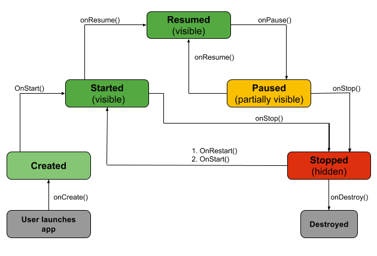
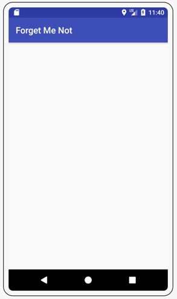

# Introduction to Android Activities with Kotlin

This is a simple example of how to use Activities in Android with Kotlin.

Tutorial: https://www.kodeco.com/2705552-introduction-to-android-activities-with-kotlin

* Project: to-do list app named **Forget Me Not**.

Activities are where all the action happens, because they are screens that allow the user to
interact with your app.

## Activity Lifecycle



Following the diagram above, you can picture the lifecycle in action as it courses through your
code. Take a closer look at each of the callbacks:

* **onCreate()**: Called by the OS when the activity is first created. This is where you initialize
  any UI elements or data objects. You also have the savedInstanceState of the activity that
  contains its previously saved state, and you can use it to recreate that state.
* **onStart()**: Just before presenting the user with an activity, this method is called. It’s
  always followed by onResume(). In here, you generally should start UI animations, audio based
  content or anything else that requires the activity’s contents to be on screen.
* **onResume()**: As an activity enters the foreground, this method is called. Here you have a good
  place to restart animations, update UI elements, restart camera previews, resume audio/video
  playback or initialize any components that you release during onPause().
* **onPause()**: This method is called before sliding into the background. Here you should stop any
  visuals or audio associated with the activity such as UI animations, music playback or the camera.
  This method is followed by onResume() if the activity returns to the foreground or by onStop() if
  it becomes hidden.
* **onStop()**: This method is called right after onPause(), when the activity is no longer visible
  to the user, and it’s a good place to save data that you want to commit to the disk. It’s followed
  by either onRestart(), if this activity is coming back to the foreground, or onDestroy() if it’s
  being released from memory.
* **onRestart()**: Called after stopping an activity, but just before starting it again. It’s always
  followed by onStart().
* **onDestroy()**: This is the final callback you’ll receive from the OS before the activity is
  destroyed. You can trigger an activity’s desctruction by calling finish(), or it can be triggered
  by the system when the system needs to recoup memory. If your activity includes any background
  threads or other long-running resources, destruction could lead to a memory leak if they’re not
  released, so you need to remember to stop these processes here as well.

> Note: You do not call any of the above callback methods directly in your own code (other than superclass invocations) — you only override them as needed in your activity subclasses. They are called by the OS when a user opens, hides or exits the activity.

## Configuring an Activity

```kotlin
class MainActivity : AppCompatActivity() {

    // 1. You initialize the activity’s properties, which include an empty mutable list of tasks and an
    // adapter initialized using by lazy.
    private val taskList = mutableListOf<String>()
    private val adapter by lazy { makeAdapter(taskList) }

    override fun onCreate(savedInstanceState: Bundle?) {
        // 2. You call onCreate() on the superclass — remember that this is (usually) the first thing
        // you should do in a callback method. There are some advanced cases in which you may call
        // code prior to calling the superclass.
        super.onCreate(savedInstanceState)
        // 3. You set the content view of your activity with the corresponding layout file resource.
        setContentView(R.layout.activity_main)

        // 4. Here you set up the adapter for taskListView. The reference to taskListView is initialized
        // using Kotlin Android Extensions. This replaces findViewById() calls and the need for other
        // view-binding libraries.
        taskListView.adapter = adapter

        // 5. You add an empty OnItemClickListener() to the ListView to capture the user’s taps on
        // individual list entries. The listener is a Kotlin lambda.
        taskListView.onItemClickListener =
            AdapterView.OnItemClickListener { parent, view, position, id ->
                // stuffs...
            }
    }

    // 6. An empty on-click method for the “ADD A TASK” button, designated by the activity_main.xml layout.
    fun addTaskClicked(view: View) {

    }

    // 7. A private function that initializes the adapter for the list view. Here you are using
    // the Kotlin = syntax for a single-expression function.
    private fun makeAdapter(list: List<String>): ArrayAdapter<String> =
        ArrayAdapter(this, android.R.layout.simple_list_item_1, list)
}
```

## Starting an Activity

And add the following implementation for addTaskClicked():

```kotlin
fun addTaskClicked(view: View) {
    // Create an intent to start the AddTaskActivity
    val intent = Intent(this, TaskDescriptionActivity::class.java)
    // Start the activity, and pass in the request code
    startActivityForResult(intent, ADD_TASK_REQUEST)
}
```

You can start an activity with either `startActivity()` or `startActivityForResult()`. They are
similar except that `startActivityForResult()` will result in `onActivityResult()` being called once
the
`TaskDescriptionActivity` finishes.

> Note: Intents are used to start activities and pass data between them. For more information, check
> out the Android: Intents Tutorial: https://www.kodeco.com/4700198-android-intents-tutorial-with-kotlin

## Creating an Activity

[...] Android Studio will automatically generate the corresponding resources needed to create the
activity. These are:

* **Class**: The class file is named `TaskDescriptionActivity.kt`. This is where you implement the
  activity’s behavior. This class must subclass the Activity class or an existing subclass of it,
  such as AppCompatActivity.

* **Layout**: The layout file is located under res/layout/ and named activity_task_description.xml.
  It defines the placement of different UI elements on the screen when the activity is created.

In addition to this, you will see a new addition to your app’s `AndroidManifest.xml` file:

```xml

<activity android:name=".TaskDescriptionActivity"></activity>
```

The `activity` element declares the activity. Android apps have a strong sense of order, so all
available activities must be declared in the manifest to ensure the app only has control of
activities declared here. You don’t want your app to accidentally use the wrong activity, or even
worse, have it use activities that are used by other apps without explicit permission.

There are several attributes that you can include in this element to define properties for the
activity, such as a label or icon, or a theme to style the activity’s UI.

`android:name` is the only required attribute. It specifies the activity’s class name relative to
the app package (hence the period at the beginning).

Now build and run the app. When you tap on ADD A TASK, you’re presented with your newly generated
activity!



In your newly generated TaskDescriptionActivity, paste the following into your class file,
overwriting anything else except the class declaration and its brackets.

```kotlin
// 1. Used the Kotlin companion object for the class to define attributes common across the class, 
// similar to static members in Java.
companion object {
    val EXTRA_TASK_DESCRIPTION = "task"
}

// 2. Overriden the onCreate() lifecycle method to set the content view for the activity from the layout file.
override fun onCreate(savedInstanceState: Bundle?) {
    super.onCreate(savedInstanceState)
    setContentView(R.layout.activity_task_description)
}

// 3. Added an empty click handler that will be used to finish the activity.
fun doneClicked(view: View) {

}
```

## Stopping an Activity

Just as important as starting an activity with all the right methods is properly stopping it.

Add the following to `doneClicked()`, which is called when the Done button is tapped in this
activity:

```kotlin
fun doneClicked(view: View) {
// 1. You retrieve the task description from the descriptionText EditText, where Kotlin Android Extensions 
// has again been used to get references to view fields.
    val taskDescription = descriptionText.text.toString()

    if (!taskDescription.isEmpty()) {
        // 2. You create a result Intent to pass back to MainActivity if the task description retrieved 
        // in step one is not empty. Then you bundle the task description with the intent and set the 
        // activity result to RESULT_OK, indicating that the user successfully entered a task.
        val result = Intent()
        result.putExtra(EXTRA_TASK_DESCRIPTION, taskDescription)
        setResult(Activity.RESULT_OK, result)
    } else {
        // 3. If the user has not entered a task description, you set the activity result to RESULT_CANCELED.
        setResult(Activity.RESULT_CANCELED)
    }

// 4. Here you close the activity.
    finish()
}
```

Once you call `finish()` in step four, the callback `onActivityResult()` will be called
in `MainActivity` — in turn, you need to add the task to the to-do list.

Add the following method to MainActivity.kt, right after `onCreate()`:

````kotlin
override fun onActivityResult(requestCode: Int, resultCode: Int, data: Intent?) {
    // 1. You check the requestCode to ensure the activity result is indeed for your add task request 
    // you started with TaskDescriptionActivity.
    if (requestCode == ADD_TASK_REQUEST) {
        // 2. You make sure the resultCode is RESULT_OK — the standard activity result for a successful 
        // operation.
        if (resultCode == Activity.RESULT_OK) {
            // 3. Here you extract the task description from the result intent and, after a null check with 
            // the let function, add it to your list.
            val task = data?.getStringExtra(TaskDescriptionActivity.EXTRA_TASK_DESCRIPTION)
            task?.let {
                taskList.add(task)
                // 4. Finally, you call notifyDataSetChanged() on your list adapter. In turn, it notifies the 
                // ListView about changes in your data model so it can trigger a refresh of its view.
                adapter.notifyDataSetChanged()
            }
        }
    }
}
````

Build and run the project to see it in action.

## Persisting State

### Persisting Data Between Launches

Open MainActivity.kt, and add the following properties to the top of the class:

```kotlin
private val PREFS_TASKS = "prefs_tasks"
private val KEY_TASKS_LIST = "tasks_list"
```

And add the following underneath the rest of your activity lifecycle methods.

```kotlin
override fun onStop() {
    super.onStop()

    // Save all data which you want to persist.
    val savedList = StringBuilder()
    for (task in taskList) {
        savedList.append(task)
        savedList.append(",")
    }

    getSharedPreferences(PREFS_TASKS, Context.MODE_PRIVATE).edit()
        .putString(KEY_TASKS_LIST, savedList.toString()).apply()
}
```

Here you build a comma separated string with all the task descriptions in your list, and then you
save the string
to [SharedPreferences](https://developer.android.com/reference/kotlin/android/content/SharedPreferences)
in the `onStop()` callback. As mentioned earlier, **`onStop()` is a good place to save data that you
want to persist across app uses**.

Next add the following to `onCreate()` below the existing initialization code:

```kotlin
val savedList =
    getSharedPreferences(PREFS_TASKS, Context.MODE_PRIVATE).getString(KEY_TASKS_LIST, null)
if (savedList != null) {
    val items = savedList.split(",".toRegex()).dropLastWhile { it.isEmpty() }.toTypedArray()
    taskList.addAll(items)
}
```

Here you read the saved list from the SharedPreferences and initialize taskList by converting the 
retrieved comma separated string to a typed array.

> Note: You used SharedPreferences since you were only saving primitive data types. For more complex
> data you can use a variety of storage options available on Android.

### Configuration Changes

You need the ability to delete entries from Forget Me Not.

Still in MainActivity.kt, at the bottom of the class add:

```kotlin
private fun taskSelected(position: Int) {
  // 1. create an AlertDialog.Builder which facilitates the creation of an AlertDialog.
  AlertDialog.Builder(this)
    // 2. set the alert dialog title.
    .setTitle(R.string.alert_title)
    // 3. set the alert dialog message to be the description of the selected task. Then you also implement 
    // the PositiveButton to remove the item from the list and refresh it, and the NegativeButton to dismiss the dialog.
    .setMessage(taskList[position])
    .setPositiveButton(R.string.delete, { _, _ ->
      taskList.removeAt(position)
      adapter.notifyDataSetChanged()
    })
    .setNegativeButton(R.string.cancel, {
      dialog, _ -> dialog.cancel()
    })
    // 4. create the alert dialog.
    .create()
    // 5. display the alert dialog to the user.
    .show()
}
```

Update the `OnItemClickListener` of the taskListView in `onCreate():

```kotlin
taskListView.onItemClickListener = AdapterView.OnItemClickListener { _, _, position, _ ->
  taskSelected(position)
}
```

### Handling Configuration Changes

Configuration changes, such as rotation, keyboard visibility and so on, cause an activity to 
shut down and restart. You can find the full list of system events that cause an activity to be recreated 
[here](https://developer.android.com/guide/topics/manifest/activity-element.html#config).

There are a couple of ways you can handle a configuration change.

One way is as follows. In AndroidManifest.xml, find the start tag:

```xml
<activity android:name=".MainActivity">
```

And change it to:

```xml
<activity android:name=".MainActivity" android:configChanges="orientation|screenSize">
```

Here, you declare that your `MainActivity` will handle any configuration changes that arise from a 
change in orientation or screen size. This simple line prevents a restart of your activity by the 
system, and it passes the work to `MainActivity`.

You can then handle these configuration changes by implementing `onConfigurationChanged()`. In 
`MainActivity.kt`, add the following method after `onStop()`:

```kotlin
override fun onConfigurationChanged(newConfig: Configuration?) {
  super.onConfigurationChanged(newConfig)
}
```

Here you’re just calling the superclass’s `onConfigurationChanged()` method since you’re not updating 
or resetting any elements based on screen rotation or size.

`onConfigurationChanged()` is passed a Configuration object that contains the updated device configuration.

By reading fields in this newConfig, you can determine the new configuration and make appropriate 
changes to update the resources used in your interface.

# Resources

Introduction to Android Activities with Kotlinby @stevenpsmith123 https://www.kodeco.com/2705552-introduction-to-android-activities-with-kotlin a través de @kodecodev 


# android-introduction-activities-kotlin
